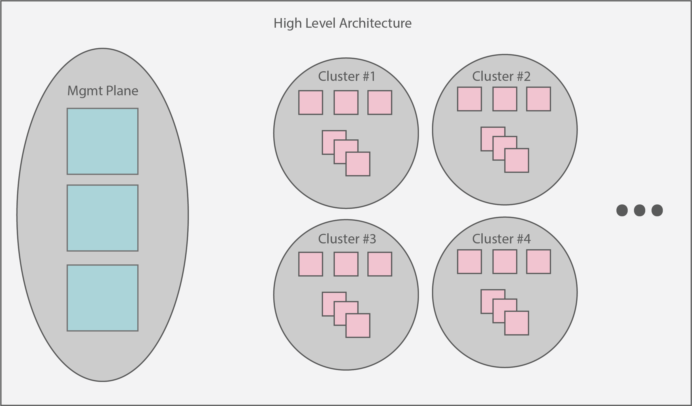
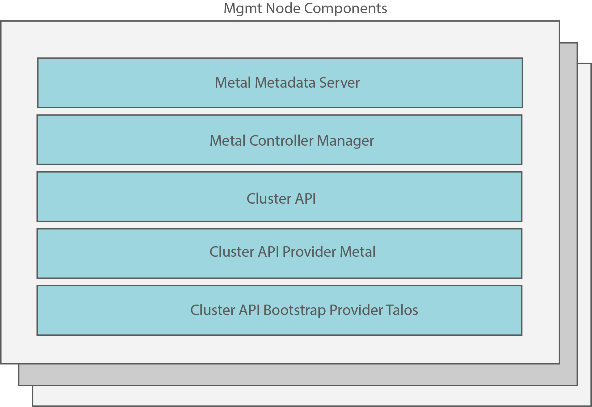

# Arges

Arges is a platform developed by Talos Systems in order to provide an easy, production-grade experience for deploying and operating multiple Kubernetes clusters in your datacenter or in a cloud environment.
For the initial release of Arges, we're heavily targeting bare metal cluster management.

## Architecture

The overarching architecture of Arges centers around a "management plane".
This plane is expected to serve as a single interface upon which administrators can create, scale, upgrade, and delete Kubernetes clusters.
At a high level view, Arges + created clusters should look something like:

## Components

Arges (and thus, the management plane) is made up of a collection of other subprojects.
Our goal is to publish known good versions of these components with each Arges release.
You can find each of these with the links below:

- [Cluster API](https://github.com/kubernetes-sigs/cluster-api)
- [Cluster API Provider Metal](https://github.com/talos-systems/cluster-api-provider-metal)
- [Cluster API Bootstrap Provider Talos](https://github.com/talos-systems/cluster-api-bootstrap-provider-talos)
- [Metal Controller Manager](https://github.com/talos-systems/metal-controller-manager)
- [Metal Metadata Server](https://github.com/talos-systems/metal-metadata-server)

A simple breakout of the management plane looks like:

## Prerequisites

Arges is built on top of [Cluster API](https://github.com/kubernetes-sigs/cluster-api).
Because of this, an existing Kuberntes cluster is required.
The cluster does not have to be based on Talos.
If you would like to use Talos as the OS of choice for the Arges control plane, you can find a number of ways to deploy Talos in the [documentation][1].

In addition to a Kubernetes cluster, the `kubectl` and `kustomize` binaries are also required.

## Examples

See the [example](./examples/README.md).

## Support

Please feel free to ask any questions about this project or mention any issues you may be having in the #support channel of our [Slack](https://slack.dev.talos-systems.io/)
