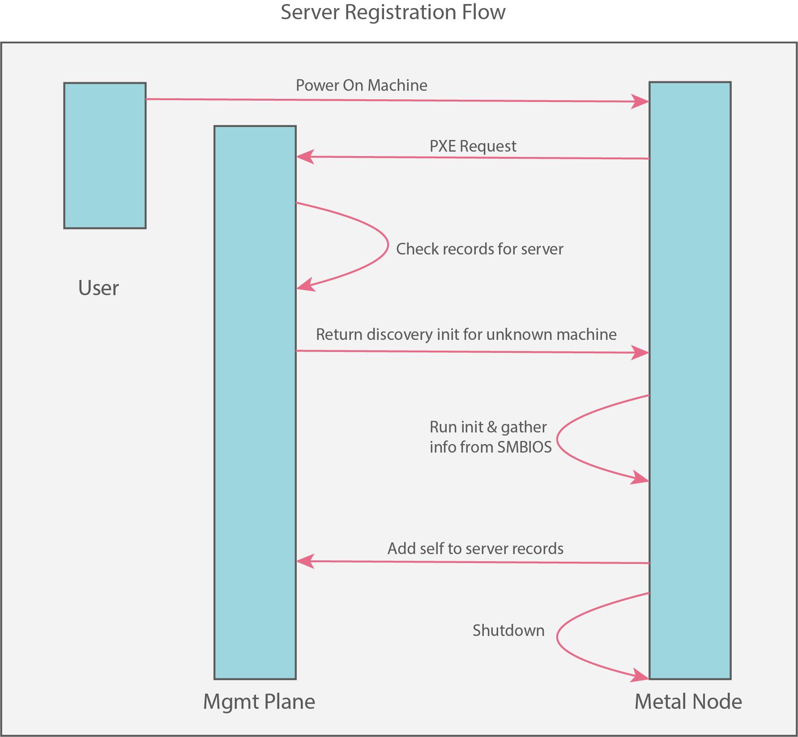
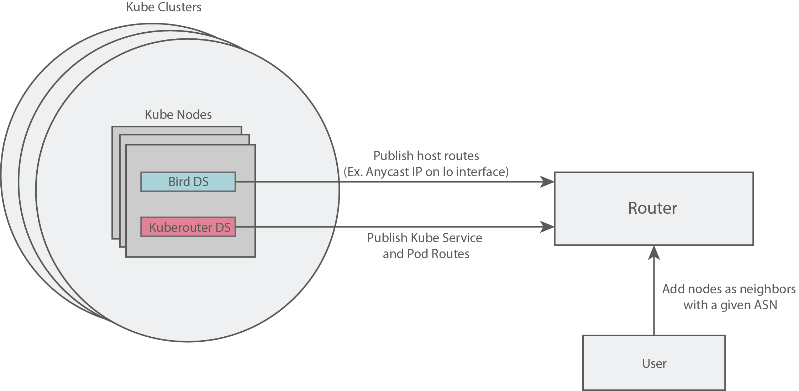

# Arges

## Prerequisites

In addition to the prerequisites outlined in the [README](../README.md), we need to host a `kubeconfig` somewhere that machines can download from.
The `kubeconfig` should be configured to talk to the cluster hosting the Arges control plane.

## Getting Started

This will deploy a number of components:

- Cluster API
- Talos Cluster API Talos bootstrap provider
- Cluster API Metal infrastructure provider
- Metal controller manager
- and the Metal metadata server

### Deploying Arges

To get started with Arges, we need to know a few bits of information beforehand.
Determining this information is dependent on how you choose to expose the Arges `metal-ipxe`, `metal-metadata-server`, and `metal-tftp` services.
However you choose to expose these services, we simply need to know the endpoint for each.

Once you determine these, and you have the discovery `kubeconfig` available over http, export the endpoints for the `metal-metadata-server` service and discovery `kubeconfig` endpoint:

```bash
cat <<EOF >mgmt/discovery_kubeconfig_patch.yaml
- op: add
  path: /spec/template/spec/containers/1/args/-
  value: --discovery-kubeconfig=${DISCOVERY_KUBECONFIG_ENDPOINT}
EOF
```

> Note: `DISCOVERY_KUBECONFIG_ENDPOINT` should include the scheme (e.g. http or https).

We will also create a dummy patch file to satisfy a requirement from kustomize.
This patch will be updated later.

```bash
cat <<EOF >mgmt/default_environment_patch.yaml
- op: add
  path: /spec/kernel/args/-
  value: talos.config=/configdata?uuid=
EOF
```

We can now deploy Arges.
To do so, run the following:

```bash
kustomize build ./mgmt | kubectl apply -f -
```

You should see the following components running as pods in the `arges-system` namespace:

```bash
$ kubectl get pods -n arges-system
NAME                                        READY   STATUS    RESTARTS   AGE
cabpt-controller-manager-7fdd65469c-pfkc9   2/2     Running   0          11s
capi-controller-manager-76798c8d9d-t8k4t    1/1     Running   0          11s
capm-controller-manager-6768c57dc5-7m2vm    2/2     Running   0          11s
metal-controller-manager-c65c7b478-srv49    2/2     Running   0          10s
metal-metadata-server-6b754c8d84-v9sb4      1/1     Running   0          10s
```

You should also see the following services:

```bash
$ kubectl get services -n arges-system -owide
NAME                                       TYPE        CLUSTER-IP    EXTERNAL-IP   PORT(S)    AGE   SELECTOR
cabpt-controller-manager-metrics-service   ClusterIP   10.96.0.200   <none>        8443/TCP   6s    arges=v1alpha1,control-plane=cabpt-controller-manager
metal-controller-manager-metrics-service   ClusterIP   10.96.0.3     <none>        8443/TCP   6s    arges=v1alpha1,control-plane=metal-controller-manager
metal-ipxe                                 ClusterIP   10.96.0.232   <none>        80/TCP     6s    arges=v1alpha1,control-plane=metal-controller-manager
metal-metadata-server                      ClusterIP   10.96.0.40    <none>        80/TCP     6s    app=metal-metadata-server,arges=v1alpha1
metal-tftp                                 ClusterIP   10.96.0.233   <none>        69/UDP     6s    arges=v1alpha1,control-plane=metal-controller-manager
```

#### Exposing the Arges Services

At this point, there are numerous ways to expose the services (`metal-ipxe`, `metal-metadata-server`, and `metal-tftp`) so that we can begin to create clusters.
We leave this as an exercise to the reader.
Please, expose these services now, ensuring that the endpoints align with the previous steps.

> Note: It is common to use an ingress controller to expose services, however, BGP may also be used.

```bash
cat <<EOF >mgmt/default_environment_patch.yaml
- op: add
  path: /spec/kernel/args/-
  value: talos.config=${METAL_METADATA_SERVER_ENDPOINT}/configdata?uuid=
EOF
```

Let's now update the existing Arges deployment:

```bash
kustomize build ./mgmt | kubectl apply -f -
```

> Note: `METAL_METADATA_SERVER_ENDPOINT` should include the scheme (e.g. http or https).
> **It is crucial that the services are exposed and your network is configured properly to boot machines using these services.**

Arges should now be fully deployed.

#### Register the Machines

With the services exposed, now we need to ensure that the Arges TFTP and iPXE servers will be used when PXE booting machines.
The way in which this is done varies greatly, and is left as an excercise for the reader.

Once we have the `metal-ipxe`, `metal-metadata-server`, and `metal-tftp` services exposed, we will use them to boot a lightweight environment that will register the machine with Arges, making it available to provision as a Kubernetes node.
To register machines, simply power them on.
The machines should do a number of things:

- boot using the deployed TFTP, and iPXE services in Arges
- download the discovery `kubeconfig`
- create a custom `server` resource in the Kubernetes cluster hosting Arges

A flow of the registration process looks like:



Once this process is done, the machine will shutdown, and you should something like the following:

```bash
$ kubectl get servers
NAME                                   AGE
00000000-0000-0000-0000-d05099d4c8ed   13s
```

### Creating a Cluster

Once we have all the machines registered that we would like to be available as resources for creating clusters, we can start creating clusters.

A high level flow of all the steps mentioned below looks like:


#### Generate the Talos Configuration Files

We will start by creating the configs required by Talos:

Run the following:

```bash
$ talosctl gen config example-0 https://192.168.1.101:6443 -o ./clusters/metal/generate
generating PKI and tokens
created clusters/metal/generate/init.yaml
created clusters/metal/generate/controlplane.yaml
created clusters/metal/generate/join.yaml
created clusters/metal/generate/talosconfig
```

Configure `talosctl`:

```bash
talosctl --talosconfig clusters/metal/generate/talosconfig config endpoint 192.168.1.101
```

Make any edits the Talos configs now.

In this example, we will designate a machine called `controlplane-0` as the `init` node.
Copy the contents of `init.yaml` into the `spec.data` field of `./talosconfigs/controlplane-0.yaml`.

This same thing should be done for `controlplane.yaml` and `join.yaml`.

> Note: For more on the concept of an `init` node, see the Talos [documentation][1].

#### Create the MetalCluster Resource

Use the following as a template and create `clusters/metal/cluster.yaml`.

```yaml
apiVersion: cluster.x-k8s.io/v1alpha2
kind: Cluster
metadata:
  name: example-0
spec:
  clusterNetwork:
    pods:
      cidrBlocks:
        - 10.244.0.0/16
    services:
      cidrBlocks:
        - 10.96.0.0/16
  infrastructureRef:
    apiVersion: infrastructure.cluster.x-k8s.io/v1alpha2
    kind: MetalCluster
    name: example-0
---
apiVersion: infrastructure.cluster.x-k8s.io/v1alpha2
kind: MetalCluster
metadata:
  name: example-0
spec:
  apiEndpoints:
    - host: <ENDPOINT>
      port: 6443
```

#### Create the TalosConfig Resources

Use the following as a template and create `clusters/metal/talosconfigs.yaml`.

```yaml
apiVersion: bootstrap.cluster.x-k8s.io/v1alpha2
kind: TalosConfig
metadata:
  name: controlplane-0
  labels:
    cluster.x-k8s.io/cluster-name: example-0
spec:
  generateType: none
  data: |
```

Using the contents of `init.yaml`, generated in a previous step, update the `spec.data` field of the `TalosConfig`.

#### Create The MetalMachine Resources

Use the following as a template and create `clusters/metal/machines.yaml`.

```yaml
apiVersion: infrastructure.cluster.x-k8s.io/v1alpha2
kind: MetalMachine
metadata:
  name: controlplane-0
spec:
  serverRef:
    apiVersion: metal.arges.dev/v1alpha1
    kind: Server
    name: <UUID>
  bmc:
    endpoint: <ENDPOINT>
    user: <USER>
    pass: <PASSWORD>
---
apiVersion: cluster.x-k8s.io/v1alpha2
kind: Machine
metadata:
  labels:
    cluster.x-k8s.io/cluster-name: example-0
    cluster.x-k8s.io/control-plane: "true"
  name: controlplane-0
spec:
  bootstrap:
    configRef:
      apiVersion: bootstrap.cluster.x-k8s.io/v1alpha2
      kind: TalosConfig
      name: controlplane-0
  infrastructureRef:
    apiVersion: infrastructure.cluster.x-k8s.io/v1alpha2
    kind: MetalMachine
    name: controlplane-0
  version: 1.17.3
```

#### Create the Cluster

Now that we have a PXE boot environment, and the Talos config files, we are ready to create our cluster.
To do so, run the following:

```bash
kubectl create namespace arges-examples
kustomize build ./clusters/metal | kubectl apply -f -
```

We can see the cluster in the `arges-examples` namespaces:

```bash
$ kubectl get clusters -n arges-examples
NAME        PHASE
example-0   provisioned
```

[1]: https://www.talos.dev "Talos"

## Extras

One of the more interesting ways we have deployed this stack is by utilizing BGP on the hosts and inside of Kubernetes itself.
This allows for services and pods in the cluster to be accessible by IP directly over the network, as well as all API servers being available by a single known IP that's attached to the loopback interface.

A simple diagram of the BGP route propagation looks like:


